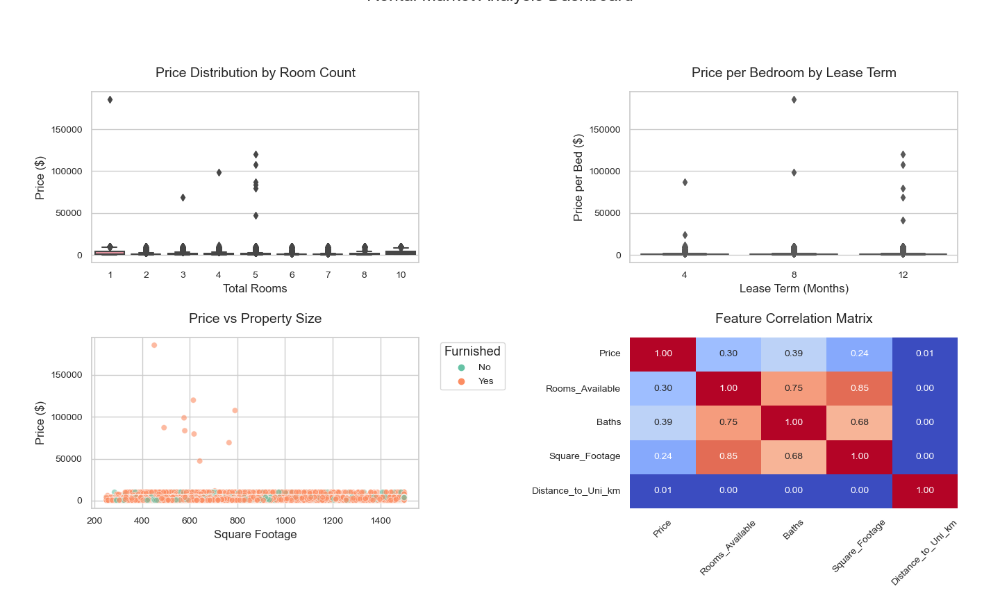
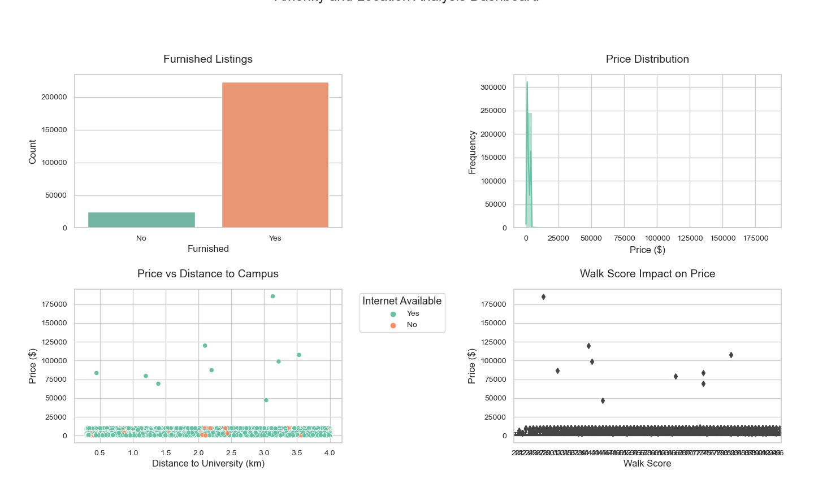

# Waterloo Student Rental Predictor  
**TL;DR**: ML-powered tool that predicts fair rent prices and detects scams for Waterloo students
# Tables of Contents 
- [Introduction](#Introduction)
- [Step-by-step Guide](#Step-by-step-Guide)
- [Inspiration](#Inspiration)
- [Data Gathering](#Data-Gathering)
- [Feature Engineering with Synthetic Rental Data](#Feature-Engineering-with-Synthetic-Rental-Data)
- [Data Preparation and Exploratory Data Analysis](#Data-Preparation-and-Exploratory-Data-Analysis)
- [Feature Engineering Overview](#Feature-Engineering-Overview)
- [Isolation Forest (ISO) - Anomaly Detection](#Isolation-Forest-(ISO)---Anomaly-Detection)
- [XGBoost (XGB) - Rental Price Prediction](#XGBoost-(XGB)---Rental-Price-Prediction)
- [Top Features Used in Models](#Top-Features-Used-in-Models)
- [FastAPI Backend Overview](#FastAPI-Backend-Overview)
- [Deployment](#Deployment)
   - [Docker Containerization](#Docker-Containerization)
   - [Render Cloud Hosting](#Render-Cloud-Hosting)
   - [Frontend on GitHub Pages](#Frontend-on-GitHub-Pages)
  
## Introduction
Welcome to the Waterloo Student Rental Predictor! This project helps students make smarter rental decisions by predicting fair prices and flagging unusual listings in the Waterloo student housing market.

Built on real [Bamboo Housing](https://bamboohousing.ca) data, enhanced with synthetic samples and custom features reflecting student needs, it uses machine learning models for price prediction and anomaly detection.

The system includes a fast API and an easy-to-use web frontend, deployed on modern cloud infrastructure.
If you’re a student hunting for a good deal, this project provides clear, actionable insights with a clean and intuitive user experience.

[Back to Tables of Contents](#Tables-of-Contents)
## Step-by-step Guide  

1. **Data Collection**  
   Scrape rental listings from Bamboo Housing, collecting key data such as price, address, description, bedrooms, bathrooms, lease type, and gender restrictions.  

2. **Synthetic Data Generation**  
   Use ChatGPT-5 to generate realistic synthetic listings that mirror patterns in the original dataset.  

3. **Feature Engineering & Preprocessing**  
   Create student-specific features (e.g., pet-friendly flags, square footage estimates), encode categorical variables, and normalize numerical fields.  

4. **Anomaly Detection**  
   Train and tune an Isolation Forest model on combined real and synthetic data to detect unusual listings.  

5. **Price Prediction**  
   Develop an XGBoost regression model optimized with feature selection and hyperparameter tuning to predict rental prices.  

6. **API Development**  
   Build a FastAPI backend to process listings, handle missing data, run anomaly checks, and output price predictions with explanations.  

7. **Deployment**  
   Containerize the API using Docker, deploy to Render.com, and host the frontend on GitHub Pages.  

8. **Frontend**  
   Create a responsive web form to submit listings and display results, including predicted price, price status, anomaly flags, and detailed feedback.

[Back to Tables of Contents](#Tables-of-Contents)
## Inspiration :sparkles:

Finding affordable, fairly priced housing near campus is a big challenge for many students, especially international or out-of-town students new to the area. Without good info or tools, it’s easy to overpay or rent places that don’t meet expectations.  

For example, when I first came to Waterloo as an international student, I struggled to find decent off-campus housing. I paid way above market price for a semi-furnished room without proper amenities.This and many other similar experiences inspired this project.  

Other strugles students face:  
- Comparing rental prices across neighborhoods and types.  
- Spotting fraudulent or poor-quality listings.  
- Dealing with seasonal price changes and demand.

[Back to Tables of Contents](#Tables-of-Contents)
## Data Gathering

One of the biggest challenges when looking for off-campus housing is avoiding scams and ensuring that the people you’re dealing with are genuine. Bamboo Housing solves this by requiring student verification for all users, as you can only post or book listings if you’re a verified student.

This means no random strangers posting fake properties or inflated prices and lastly, its a safe community where both tenants and landlords are verified members of the student population.

URL Scraped for 7500 listings: https://bamboohousing.ca/homepage

[Back to Tables of Contents](#Tables-of-Contents)
## Feature Engineering with Synthetic Rental Data
To enhance my dataset for training, I used ChatGPT Model 5 to generate synthetic rows. These rows were created by analyzing patterns, ranges, and distributions from the original real-world Waterloo housing data, specifically features like location, property type, bedroom/bathroom count, amenities, and pricing trends.

The synthetic dataset was designed to mimic real listings and by augmenting the dataset to a total of 250,000 rows, I was able to train more robust and accurate machine learning models for rent prediction and anomaly detection.
The following ChatGPT prompt was used in model 5 to generate the synthetic data:
```
## Synthetic Data Generation for Waterloo Student Rentals

You are given a scraped dataset of rental listings from **Bamboo Housing** for **Waterloo, Ontario** — a student-heavy city.  

Your task is to:

1. Understand & Analyze the Original Data
- Learn the structure, column meanings, value ranges, and data types from the scraped dataset.
- Identify trends such as:
  - Typical rental price ranges by room type and lease type.
  - Seasonal listing patterns.
  - Common description styles and keywords.
  - Bed/Bath distributions and their price relationships.
  - Gender restrictions in shared rentals.
  - Detect correlations (e.g., price vs. Bed_Bath, furnished vs. unfurnished, lease type vs. price).

2. Generate Synthetic Rows Following the Same Patterns
- Create enough synthetic rows to reach a total of **15,000 rows** (including the scraped data).
- Keep data statistically consistent with the scraped dataset’s trends.
- Maintain realistic natural language in `Description`, following the tone and style of actual listings.
- Ensure plausible `Address` and neighborhoods for Waterloo (Northdale, Beechwood, Uptown, Laurelwood, etc.).

3. Final Dataset Columns
The final dataset contains only:
- `Price`: numeric, monthly rent in CAD
- `Address`: realistic street or neighborhood name
- `Description`: short listing text
- `Bed_Bath`: e.g., `"3 Bed / 2 Bath"`
- `Lease_Type`: e.g., `8-month`, `12-month`, `4-month`
- `Room_Info`: e.g., `single room`, `shared`, `ensuite`, `bachelor`
- `Gender`: `Male`, `Female`, `Coed`
- `Scraped_At`: `YYYY-MM-DD`

4. Realism Rules
- Keep pricing ranges and seasonal demand spikes in line with the original dataset.
- Reflect student market patterns:
  - Higher prices near University of Waterloo and Wilfrid Laurier University.
  - Cheaper per-room rates in shared houses further from campus.
- Match the ratio of furnished vs. unfurnished, lease types, and room configurations seen in the scraped data.

5. Engineered additional features for richer modeling:  
  - Pet_Friendly: Assigned with a ratio of 25–35% based on CMHC reports for student rentals.  
  - Furnished: Set to 80–95%, reflecting high furnishing rates in student-heavy markets like Waterloo.  
  - Parking_Included: Assigned with a 50–60% ratio, based on city rental permit studies for student housing.  
  - Internet_Available: Set to 90–95% availability, as internet is nearly always included in student-oriented rentals.  
  - Square_Footage: Assigned based on average square footage for a standard room, with variations to reflect real-world ranges.  
```

[Back to Tables of Contents](#Tables-of-Contents)
## Data Preparation and Exploratory Data Analysis

**Data Preprocessing**
   - **One-Hot Encoding**: Converted categorical variables into one-hot encoded vectors for machine learning compatibility.
   - **Boolean Conversion**: Transformed boolean columns into integer format (0 and 1) for consistency.
   - **Feature Scaling**: Applied feature scaling techniques (e.g., MinMaxScaler or StandardScaler) to normalize numerical values.

**Exploratory Data Analysis (EDA)**
   - **Feature Comparison**: Compared column-level values to check for inconsistencies or anomalies.
   - **Correlation Analysis**: Generated correlation matrices to identify relationships between features and target variables.
   - **Distribution Analysis**: Visualized feature distributions using histograms, KDE plots, and box plots to understand data spread and detect outliers.




## Feature Engineering Overview

- Created over 130 features tailored for Waterloo student rentals.
- Focused on capturing key aspects affecting price and desirability.

Key feature groups:

- **Property Space Metrics:**  
  Room density, square footage per room, bathroom ratios, occupancy rates etc to measure space efficiency and overcrowding.

- **Binary Flags:**  
  Indicators like studio units, luxury setups, overcrowding to highlight typical and special cases.

- **Location Features:**  
  Distance to campus categorized into tiers, estimated walk/bike times, and accessibility scores reflecting student preferences.

- **Lease Dynamics:**  
  Lease duration tiers, seasonal demand flags, and interactions with location to capture academic calendar effects.

- **Amenity Analysis:**  
  Furnishing, parking, internet, pet-friendliness flags plus interaction terms to model bundled amenity appeal.

- **Anomaly Indicators:**  
  Flags for unusual density, amenity mismatches, and statistical outliers to improve detection of suspicious listings.

[Back to Tables of Contents](#Tables-of-Contents)
## Isolation Forest (ISO) - Anomaly Detection

### Model Selection
- Chose Isolation Forest for its effectiveness with mixed numeric and categorical data (after encoding) without heavy scaling.
- Compared with Local Outlier Factor (LOF) and ensemble methods; ISO provided more stable results and fewer false positives.
- Computationally efficient on 15,000+ records, enabling iterative development and tuning.
- Hyperparameters tuned using grid search to optimize anomaly detection performance.

### Feature Reduction and Hyperparameter Tuning
- Removed features with high correlation (threshold > 0.9) to reduce redundancy.
- Trained a Random Forest Regressor to approximate Isolation Forest anomaly scores.
- Ranked features by importance and applied permutation importance testing to validate impact.
- Selected top 9 most important features for the final ISO model to reduce noise and improve performance.

### Results
- Produced stable and interpretable anomaly scores highlighting outliers such as overpriced listings or inconsistent amenity setups.
- Demonstrated lower false positive rates compared to LOF in dense student housing clusters.
- Enabled fast inference for real-time anomaly detection within the API.

---
[Back to Tables of Contents](#Tables-of-Contents)
## XGBoost (XGB) - Rental Price Prediction

### Model Selection
- Evaluated XGBoost alongside LightGBM, CatBoost, and ensemble models for regression.
- XGBoost outperformed alternatives in terms of R² and RMSE metrics on validation data.
- Employed Optuna for automated hyperparameter optimization to maximize predictive accuracy.

### Feature Reduction and Hyperparameter Tuning
- Eliminated highly correlated and weakly correlated features with the target variable.
- Applied Recursive Feature Elimination (RFE) to refine the feature set.
- Finalized on 10 most predictive features representing rental, room, and lease characteristics.

### Results
- Achieved R² greater than 0.8 on validation datasets, indicating strong explanatory power.
- Delivered low RMSE, providing accurate rental price estimates.
- Supported actionable insights by flagging over- or under-priced listings compared to predicted values.

[Back to Tables of Contents](#Tables-of-Contents)
## Top Features Used in Models

**Isolation Forest (Anomaly Detection) Features:**
- `Available_Room_Pct`: Percentage of available rooms relative to total rooms.
- `Furnished_X_Internet`: Interaction term indicating presence of both furnishing and internet.
- `Is_Luxury_Setup`: Flag for luxury configurations (e.g., multiple baths, large sqft).
- `Baths`: Number of bathrooms.
- `Sqft_per_Room`: Average square footage per room.
- `Bathroom_Ratio`: Ratio of bathrooms to total rooms.
- `Amenity_Score`: Aggregate score of key amenities (furnishing, parking, internet, pet-friendly).
- `Is_Pet_Friendly`: Binary flag indicating pet-friendly status.
- `Parking_X_Pet`: Interaction term between parking availability and pet-friendliness.

**XGBoost (Price Prediction) Features:**
- `Shared_Quality`: Measure of shared room condition or quality.
- `Baths`: Number of bathrooms.
- `Is_Shared_Setup`: Flag indicating if the unit is a shared setup.
- `Bed_Bath_Ratio`: Ratio of bedrooms to bathrooms.
- `Total_Rooms`: Total number of rooms.
- `Bathroom_Ratio`: Ratio of bathrooms to total rooms.
- `Available_Room_Pct`: Percentage of rooms available.
- `Is_Balanced`: Flag for balanced room-to-bath ratio.
- `Is_Spacious`: Indicator for larger-than-average space.
- `Rooms_Available`: Number of rooms currently available.

[Back to Tables of Contents](#Tables-of-Contents)
## FastAPI Backend Overview

The backend is built with FastAPI to provide a lightweight, high-performance API for rental listing evaluation. It handles:

- **Data Completion:** Automatically fills missing inputs (e.g., estimates square footage based on rooms, assumes pet-friendly or furnished status with realistic probabilities) to ensure robust predictions even when users provide incomplete data.

- **Feature Engineering:** Transforms raw inputs into the 9 key features used for anomaly detection and price prediction in real-time.

- **Anomaly Detection:** Uses the trained Isolation Forest model to identify unusual listings based on learned student rental patterns.

- **Price Prediction:** Runs the XGBoost model to estimate fair market rent and compares it with user input to flag potential overpricing or underpricing.

- **Combined Assessment:** Integrates rule-based checks with ML model outputs to provide a comprehensive anomaly flag and detailed explanations for flagged listings.

The API returns structured JSON responses with predicted price, pricing status, anomaly flags, and user-friendly explanations to support informed rental decisions.

[Back to Tables of Contents](#Tables-of-Contents)
## Deployment

### Docker Containerization

The FastAPI backend is containerized using Docker to ensure portability and consistency across environments. The Dockerfile is based on a lightweight Python 3.10-slim image and includes:

- Installing all dependencies via `requirements.txt`
- Copying application code into the container
- Exposing port 8000 for API access
- Launching the app with Uvicorn ASGI server for async performance

This setup allows easy local testing, seamless cloud deployment, and version-controlled builds.

[Back to Tables of Contents](#Tables-of-Contents)
### Render Cloud Hosting

The Docker container is deployed on Render.com, it provided the following:

- Automated container builds from Docker images stored in container registries
- Free tier availability with 750 monthly runtime hours
- Auto-scaling and continuous deployment triggered by code pushes

[Back to Tables of Contents](#Tables-of-Contents)
### Frontend on GitHub Pages

Made the frontend using ChatGPT model 5 and DeepSeek using the following prompt:
```
Build a responsive rental price predictor web app using:
Tech Stack: vite_react_shadcn_ts_20250728_minor

Requirements:

Form Fields (with proper HTML5 validation):
Required:
Price (number input)
Baths (number)
Total Rooms (number)
Rooms Available (number)
Optional:
Furnished (dropdown: Yes/No/None)
Internet Available (dropdown: Yes/No/None)
Parking Included (dropdown: Yes/No/None)
Pet Friendly (dropdown: Yes/No/None)
Square Footage (Add sq ft or 0 if unsure)
API Integration:
POST JSON to https://price-predictor-latest.onrender.com/predict
Headers: { "Content-Type": "application/json" }
Handle 4xx/5xx errors with user-friendly alerts
Results Display:
Predicted Price (large text, green if within 10% of input price)
Price Status (e.g., "Overpriced by $200")
Anomaly Indicator (red flag if anomaly_flag=1)
Explanation Bullet Points (from API's explanations array)
UI/UX:
Mobile-first responsive layout
Form validation before submission
Loading state during API calls
Error boundary for failed fetches
Dark/light mode support via shadcn
Code Quality:
TypeScript interfaces for API request/response
React Hook Form for state management
Zod validation schema
Unit tests for form submission logic
Deliverables:

Clean, accessible form with proper labels
Results section with visual hierarchy
Console-free production build"
```
The user interface is a clean, responsive web form generated via AI prompt engineering and hosted on GitHub Pages for fast, reliable static site delivery. The frontend:

- Accepts user input for rental listing details
- Sends JSON requests to the Render-hosted FastAPI backend
- Displays predicted prices, anomaly flags, and explanations clearly
- Supports mobile and desktop devices
- Handles missing optional inputs gracefully and includes error handling for failed API calls

This separation of frontend (GitHub Pages) and backend (Render) simplifies development and deployment workflows.

[Back to Tables of Contents](#Tables-of-Contents)
